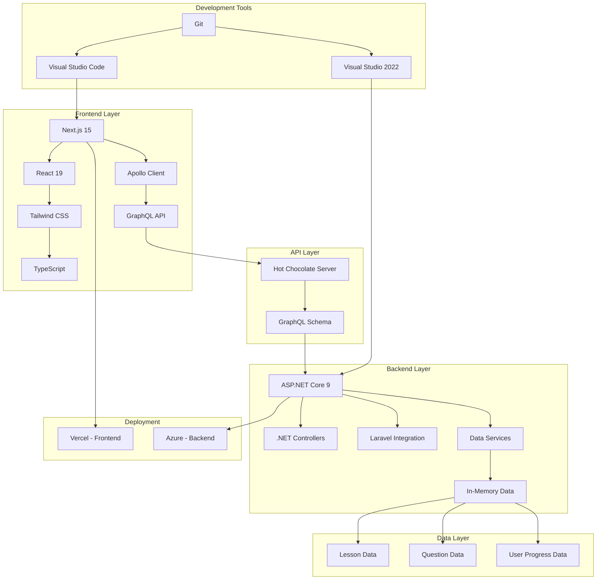

# Fullstack Academy - Fullstack Learning & Interview Trainer

## Project Overview

Fullstack Academy is a full-stack educational platform designed to help developers learn and prepare for interviews in modern web technologies. The application provides structured learning resources and realistic interview practice with instant feedback.

> **Note**: This is purely a learning and coding challenge! No real application would (or should) be architected this way. In the real world, you wouldn't run 5+ separate technology stacks just to teach about them. But for the sake of learning and demonstrating proficiency in each technology, we've gone a bit overboard with the architecture. Think of it as an educational extreme sport!

## Features

- **Learning Tracks**: Comprehensive lessons for .NET, Next.js, GraphQL, Laravel, React, Tailwind CSS, Node.js, and SASS
- **Step-by-Step Lessons**: Code examples with expected outputs
- **Interview Quizzes**: Multiple-choice and open-ended questions
- **Progress Tracking**: Local storage-based progress tracking
- **Gamification**: Certificate rewards for completed modules
- **Modern UI**: Built with Next.js, React, and Tailwind CSS
- **Responsive Design**: Adapts to different screen sizes with a wider layout for better module visibility

## Technology Stack

### Frontend
- Next.js 15
- React 19
- TypeScript
- Tailwind CSS
- Apollo Client for GraphQL integration

### Backend
- ASP.NET Core 9 Web API (C#)
- GraphQL API (HotChocolate)
- In-memory data storage

## System Architecture

The application follows a full-stack architecture with a Next.js frontend and ASP.NET Core Web API backend, communicating via a GraphQL API.

> **Architectural Note**: We've also implemented a completely separate module-based architecture where each technology is implemented using its own stack. This is purely for educational purposes - a real application would use a more sensible unified approach!



## Directory Structure

```
dotNetQuiz/
├── dot-net-quiz/
│   ├── backend/
│   │   ├── Controllers/
│   │   ├── Data/ (JSON files with content for all technologies)
│   │   ├── GraphQL/
│   │   ├── Models/
│   │   ├── Services/
│   │   └── Program.cs
│   └── frontend/
│       ├── src/
│       │   ├── app/
│       │   │   ├── graphql/
│       │   │   ├── interview/
│       │   │   ├── lessons/
│       │   │   ├── nextjs/
│       │   │   ├── laravel/
│       │   │   ├── react/
│       │   │   ├── tailwind/
│       │   │   ├── node/
│       │   │   ├── sass/
│       │   │   └── page.tsx
│       │   ├── components/
│       │   └── apolloClient.ts
│       └── package.json
├── laravel-backend/ (complete Laravel application structure)
└── README.md
```

## Technology Modules Implementation

### Backend Technologies

#### .NET, Next.js, and GraphQL Modules
- Core modules with structured lessons and interview questions

#### Laravel Modules
1. **Standalone Laravel Backend**: A complete Laravel application structure with models, controllers, and routes
2. **GraphQL Integration**: Laravel content is seamlessly integrated into the .NET GraphQL API
3. **Data Synchronization**: Laravel content is stored as JSON files in the .NET backend but maintains the Laravel data structure

##### Laravel Content Structure
- Routing fundamentals (Basic Routing, Route Parameters)
- Eloquent ORM basics (Introduction to Eloquent, Querying Models)
- Blade templating (Blade Basics, Blade Control Structures)
- Middleware (Creating Middleware, Registering Middleware)
- Database (Migrations, Seeding Data)
- Authentication (Laravel Breeze, API Authentication)

##### Laravel Interview Questions
- 35 professional multiple-choice and open-ended questions covering core Laravel concepts

### Frontend Technologies

#### React Modules
1. **Component-Based Learning**: Lessons on React components, hooks, and state management
2. **Interactive Quizzes**: Interview questions covering React fundamentals and advanced concepts
3. **Technology-Specific Styling**: Blue-themed interface for React content

#### Tailwind CSS Modules
Utility-first CSS framework for rapid UI development

#### Node.js Modules
1. **Server-Side JavaScript**: Lessons on Node.js fundamentals and Express.js
2. **Interactive Quizzes**: Interview questions covering Node.js concepts
3. **Technology-Specific Styling**: Green-themed interface for Node.js content

#### SASS Modules
CSS preprocessor with variables, nesting, and mixins

## API Endpoints

All data is accessed through GraphQL queries and mutations:

### Queries
- `dotNetLessons`, `nextJsLessons`, `graphQLLessons`, `laravelLessons`
- `reactLessons`, `tailwindLessons`, `nodeLessons`, `sassLessons`
- `dotNetInterviewQuestions`, `nextJsInterviewQuestions`, `graphQLInterviewQuestions`, `laravelInterviewQuestions`
- `reactInterviewQuestions`, `tailwindInterviewQuestions`, `nodeInterviewQuestions`, `sassInterviewQuestions`

### Mutations
- `submitAnswer` (for all modules)
- `submitLaravelAnswer` (Laravel-specific)
- `submitReactAnswer` (React-specific)
- `submitTailwindAnswer` (Tailwind-specific)
- `submitNodeAnswer` (Node.js-specific)
- `submitSassAnswer` (SASS-specific)
- `trackProgress`

## Setup Instructions

### Prerequisites
- .NET 9 SDK
- Node.js 18+

### Backend Setup
```bash
cd dot-net-quiz/backend
dotnet restore
dotnet run
```

The backend will start on `http://localhost:5022`

### Frontend Setup
```bash
cd dot-net-quiz/frontend
npm install
npm run dev
```

The frontend will start on `http://localhost:3000`

## Development Workflow

1. **Backend Development**: Modify C# files in the backend directory
2. **Frontend Development**: Modify TypeScript/React files in the frontend directory
3. **GraphQL Schema**: Changes to the GraphQL schema require updates to both the backend types and frontend queries

## Deployment

### Frontend (Vercel)

1. Ensure the frontend code is in a Git repository
2. Connect your Git repository to Vercel:
   - Log in to your Vercel account
   - Click "New Project"
   - Import your Git repository
3. Configure Project Settings in Vercel:
   - Build Command: `npm run build`
   - Output Directory: `.next`
   - Install Command: `npm install`
   - Development Command: `npm run dev`
4. Set up environment variables in Vercel dashboard:
   - Name: `NEXT_PUBLIC_API_BASE`
   - Value: The URL of your deployed backend
5. Deploy the application

### Backend (.NET)

The .NET backend can be deployed to any platform that supports .NET 9:

#### Azure App Service
1. Create an Azure App Service for .NET
2. Deploy the backend using Azure CLI or Visual Studio
3. Configure the App Service to use .NET 9 runtime
4. Update CORS settings to allow requests from your Vercel domain

#### Other Options
- AWS Elastic Beanstalk
- Google Cloud Run
- DigitalOcean App Platform

### Local Development

#### Frontend
```bash
npm run build
```

#### Backend
```bash
dotnet publish
```

The application expects the backend API at `http://localhost:5022` by default (configurable via environment variables).

## Contributing

1. Fork the repository
2. Create a feature branch
3. Commit your changes
4. Push to the branch
5. Create a pull request

## License

This project is licensed under the MIT License.

## Troubleshooting

### Common Issues

1. **Port Conflicts**: If ports 5022 or 3000 are in use, the applications will automatically select available ports
2. **GraphQL Schema Errors**: Ensure all GraphQL types are properly registered in Program.cs
3. **CORS Issues**: CORS policies are configured for localhost development

### Testing GraphQL Endpoints

Test Laravel lessons query:
```bash
curl -X POST -H "Content-Type: application/json" -d '{"query":"{ laravelLessons { id title topic } }"}' http://localhost:5022/graphql
```

Test React lessons query:
```bash
curl -X POST -H "Content-Type: application/json" -d '{"query":"{ reactLessons { id title topic } }"}' http://localhost:5022/graphql
```

Test Tailwind lessons query:
```bash
curl -X POST -H "Content-Type: application/json" -d '{"query":"{ tailwindLessons { id title topic } }"}' http://localhost:5022/graphql
```

Test Node.js lessons query:
```bash
curl -X POST -H "Content-Type: application/json" -d '{"query":"{ nodeLessons { id title topic } }"}' http://localhost:5022/graphql
```

Test SASS lessons query:
```bash
curl -X POST -H "Content-Type: application/json" -d '{"query":"{ sassLessons { id title topic } }"}' http://localhost:5022/graphql
```