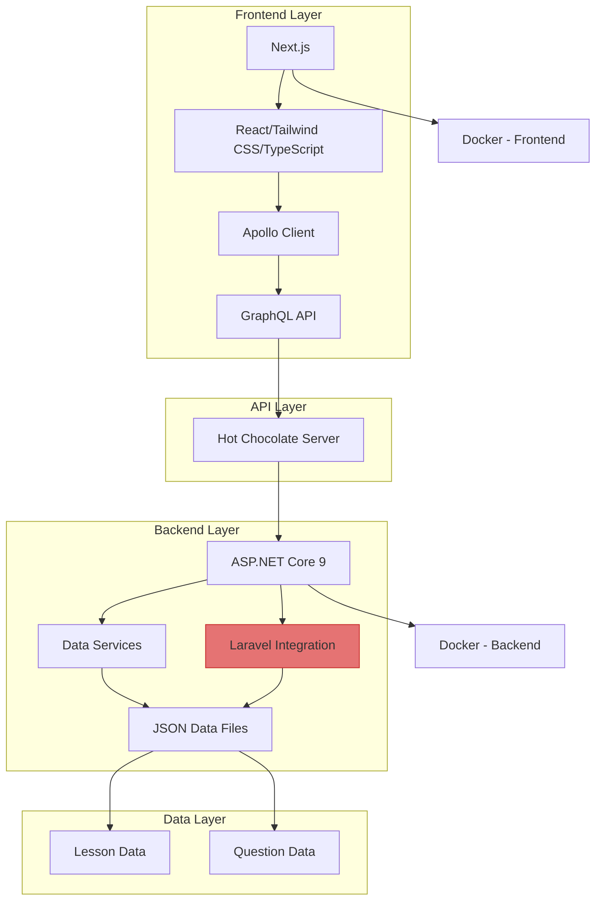
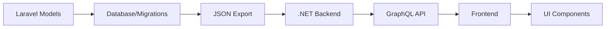
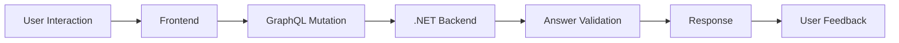

# Fullstack Academy - Technology Stack Integration

This document provides a comprehensive overview of the technology stack used in Fullstack Academy and how the different components integrate with each other.

## Overview

Fullstack Academy is a full-stack educational platform built with a polyglot approach, combining multiple technologies to create a unified learning experience. The platform allows users to learn different web frameworks and technologies through interactive lessons and quizzes.

## Current Architecture

The application follows a modern architecture with a unified GraphQL API layer that integrates content from multiple technology tracks:

## Technology Stack

### Frontend

#### Next.js 15
- React-based framework for production-ready applications
- Server-side rendering and static site generation
- File-based routing system
- API routes for backend functionality
- Built-in optimization features

#### React 19
- Component-based UI library
- Virtual DOM for efficient rendering
- Hooks for state and lifecycle management
- Context API for state management

#### TypeScript
- Typed superset of JavaScript
- Compile-time error checking
- Enhanced IDE support
- Improved code maintainability

#### Tailwind CSS
- Utility-first CSS framework
- Responsive design utilities
- Dark mode support
- Customizable design system

#### Apollo Client
- GraphQL client for fetching, caching, and mutating data
- Reactive state management
- Integration with React hooks
- Automatic caching and refetching

### Backend

#### ASP.NET Core 9
- Cross-platform, high-performance framework
- Built-in dependency injection
- Middleware pipeline
- Configuration system
- Logging and diagnostics

#### Hot Chocolate GraphQL
- GraphQL server implementation for .NET
- Schema-first and code-first approaches
- Real-time subscriptions
- Automatic schema generation
- Built-in tooling (Banana Cake Pop)

#### Laravel Integration
- Standalone Laravel application structure
- Eloquent ORM models
- RESTful API controllers
- Database migrations
- JSON data synchronization

### Data Storage

#### JSON Files
- Lightweight data storage for development
- Easy content management
- Version control friendly
- Simple backup and restore

### Development and Deployment

#### Build Tools
- **Frontend**: Next.js build system with Webpack
- **Backend**: .NET CLI tools
- **Laravel**: Composer for dependency management

#### Package Managers
- **Frontend**: npm
- **Backend**: NuGet
- **Laravel**: Composer

#### Deployment Targets
- **Frontend**: Docker Containers
- **Backend**: Docker Containers

## Integration Patterns

### GraphQL Integration

The application uses GraphQL as a unified API layer that integrates content from all technology tracks:

1. **Schema Definition**: GraphQL schema defines types for all content
2. **Resolvers**: Resolvers fetch data from appropriate sources
3. **Queries**: Clients can fetch exactly the data they need
4. **Mutations**: Clients can modify data through standardized operations

### Laravel Integration Pattern

The integration between Laravel and the .NET backend follows a sophisticated pattern:

1. **Standalone Laravel Backend**: A complete Laravel application structure is maintained
2. **JSON Data Files**: Content is exported as JSON files that mirror the Laravel database structure
3. **GraphQL Types**: Custom GraphQL types are defined for Laravel content
4. **Query Resolvers**: GraphQL queries load data from JSON files
5. **Mutation Resolvers**: Answer validation is handled through dedicated services

### Frontend Integration

The Next.js frontend consumes content through the unified GraphQL API:

1. **Apollo Client**: Manages GraphQL communication
2. **React Components**: UI components for displaying content
3. **State Management**: Local storage for progress tracking
4. **Responsive Design**: Mobile-first approach with Tailwind CSS

## Data Flow

### Lesson Content Flow

### Quiz Interaction Flow

## Component Architecture

### Frontend Components

1. **Page Components**: Route-based components for different sections
2. **UI Components**: Reusable components for consistent design
3. **Layout Components**: Shared layout structure
4. **Context Providers**: State management providers

### Backend Components

1. **Controllers**: Handle HTTP requests
2. **GraphQL Types**: Define schema types
3. **Services**: Business logic implementation
4. **Models**: Data structure definitions

### Laravel Components

1. **Models**: Eloquent ORM models
2. **Controllers**: REST API controllers
3. **Migrations**: Database schema definitions
4. **Routes**: API endpoint definitions

## Benefits of Current Architecture

### Polyglot Learning Approach
- Exposure to multiple technologies in a single platform
- Real-world experience with different frameworks
- Comparative learning experience

### Unified Interface
- Consistent UI across all technology tracks
- Shared components reduce development effort
- Single codebase for frontend logic

### Flexible Data Access
- GraphQL allows precise data fetching
- Single endpoint for all content
- Reduced network requests

### Maintainable Structure
- Modular design allows for easy expansion
- Clear separation of concerns
- Well-defined integration points

## Future Considerations

### Migration to Full Laravel Backend
- Refer to [ROADMAP.md](ROADMAP.md) for detailed migration plan
- Benefits of unified PHP/Laravel stack
- Leveraging full Laravel ecosystem

### Advanced Features
- User authentication and profiles
- Social learning features
- AI-powered content recommendation
- Advanced analytics and reporting

## Conclusion

The current architecture of Fullstack Academy provides a robust foundation for delivering educational content across multiple technology tracks. The integration of a standalone Laravel backend structure with the .NET GraphQL API creates a flexible system that can evolve toward a fully Laravel-powered solution while maintaining the benefits of the current polyglot approach.