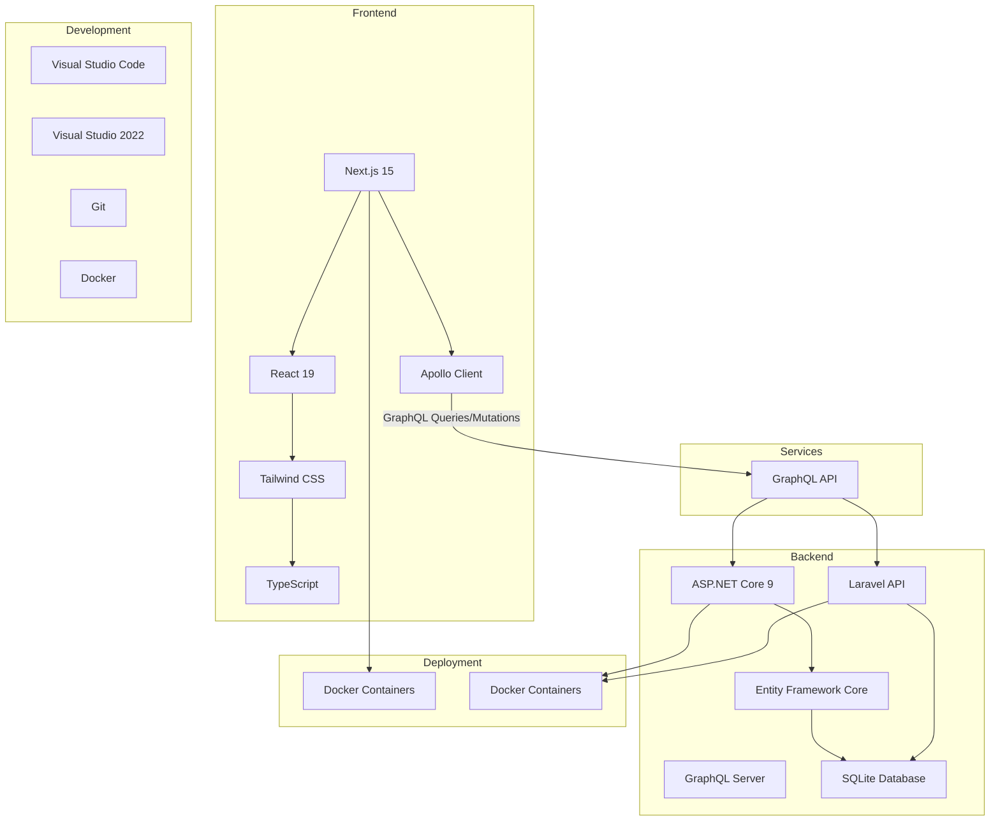

# Fullstack Academy Tech Stack

This document outlines the technology stack used in the Fullstack Academy application and how the different components integrate with each other.

## Architecture Overview

## Technology Components

### Frontend Technologies

1. **Next.js 15**
   - React framework with App Router
   - Server-side rendering and static site generation
   - API routes for backend integration
   - Built-in optimization features

2. **React 19**
   - Component-based UI library
   - Hooks for state management
   - Server Components for performance

3. **Tailwind CSS**
   - Utility-first CSS framework
   - Responsive design system
   - Dark mode support

4. **TypeScript**
   - Static typing for JavaScript
   - Improved developer experience
   - Better error detection

5. **Apollo Client**
   - GraphQL client for data fetching
   - Caching and state management
   - Integration with React components

### Backend Technologies

1. **ASP.NET Core 9**
   - Cross-platform web framework
   - High-performance runtime
   - Built-in dependency injection

2. **Entity Framework Core**
   - Object-relational mapper (ORM)
   - Database abstraction layer
   - LINQ for database queries

3. **GraphQL Server**
   - Banana Cake Pop GraphQL server
   - Schema-first development
   - Real-time subscriptions support

4. **Laravel API**
   - PHP web application framework
   - Eloquent ORM for database operations
   - RESTful API endpoints

5. **SQLite Database**
   - Lightweight relational database
   - File-based storage
   - Zero configuration setup

### Development Tools

1. **Visual Studio Code**
   - Frontend development environment
   - Extensions for Next.js and TypeScript

2. **Visual Studio 2022**
   - Backend development environment
   - Debugging and profiling tools

3. **Git**
   - Version control system
   - Collaboration workflow

4. **Docker**
   - Containerization for consistent environments
   - Simplified deployment process

### Deployment Platforms

1. **Docker Containers**
   - Containerized deployment for consistency
   - Easy scaling and management
   - Platform-agnostic deployment

2. **Render.com**
   - Cloud platform for container hosting
   - Automatic deployments from Git
   - Free tier for development and testing

## Integration Flow

1. **Frontend to Backend Communication**
   - Apollo Client sends GraphQL queries to the GraphQL API
   - GraphQL server resolves queries by calling appropriate services
   - Data is fetched from either .NET or Laravel backends
   - Responses are returned through the GraphQL layer to the frontend

2. **Data Flow**
   - User interactions trigger GraphQL queries/mutations
   - GraphQL server routes requests to appropriate resolvers
   - Resolvers interact with .NET or Laravel services
   - Services access data through Entity Framework Core or Eloquent ORM
   - Data is retrieved from SQLite database
   - Responses flow back through the stack to the UI

3. **Development Workflow**
   - Code changes are committed to Git
   - Continuous integration builds and tests changes
   - Successful builds are automatically deployed
   - Frontend and backend services are deployed as Docker containers
   - Services are hosted on Render.com

## Benefits of This Architecture

1. **Separation of Concerns**
   - Frontend focuses on UI/UX
   - Backend services handle business logic
   - GraphQL layer provides a unified API

2. **Technology Diversity**
   - Multiple backend frameworks for learning
   - Modern frontend stack for best practices
   - Industry-standard tools and platforms

3. **Scalability**
   - Microservices architecture
   - Independent scaling of components
   - Cloud-native deployment

4. **Developer Experience**
   - Type safety with TypeScript
   - Hot reloading during development
   - Comprehensive debugging tools