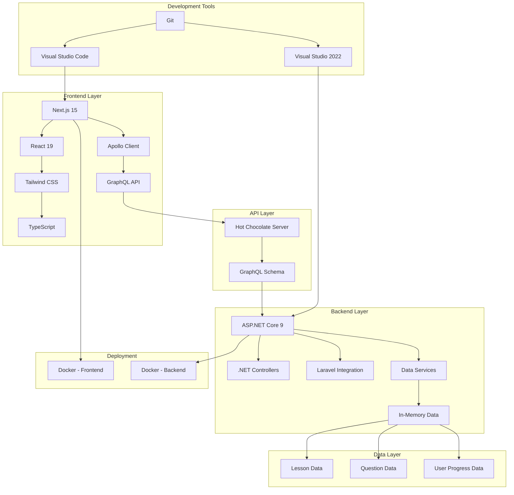

# Fullstack Academy Tech Stack Integration

This document provides a comprehensive overview of how all technologies in the Fullstack Academy application integrate with each other to create a cohesive learning platform.

## System Architecture Diagram

## Technology Integration Details

### 1. Frontend Integration (Next.js + React + Tailwind CSS)

**Next.js 15** serves as the primary framework for the frontend, providing:
- Server-side rendering for improved performance
- File-based routing system
- API routes for backend communication
- Built-in optimization features

**React 19** powers the UI components with:
- Component-based architecture
- State management through hooks
- Server Components for performance optimization

**Tailwind CSS** provides styling with:
- Utility-first CSS framework
- Responsive design system
- Dark mode support through class toggling
- Consistent design language across components

**TypeScript** ensures type safety with:
- Static typing for JavaScript
- Improved developer experience
- Better error detection during development

**Apollo Client** handles GraphQL communication:
- Query and mutation execution
- Client-side caching
- State management for GraphQL data

### 2. API Layer Integration (GraphQL)

**Hot Chocolate Server** provides the GraphQL API:
- Schema-first development approach
- Type-safe GraphQL resolvers
- Real-time subscriptions support
- Built-in GraphQL Playground (Banana Cake Pop)

**GraphQL Schema** defines the data contract:
- Strongly-typed queries and mutations
- Unified API for all backend services
- Flexible data fetching capabilities

### 3. Backend Integration (.NET + Laravel)

**ASP.NET Core 9** serves as the primary backend framework:
- Cross-platform web framework
- High-performance runtime
- Built-in dependency injection
- Middleware pipeline for request processing

**Laravel Integration** provides PHP-based functionality:
- Eloquent ORM for database operations
- Blade templating engine
- Artisan command-line interface
- Authentication scaffolding

**Data Services** handle business logic:
- Data querying and filtering
- Answer validation for quizzes
- Progress tracking for users
- Mock data generation for development

### 4. Data Layer Integration

**In-Memory Data** provides development data:
- Lesson content for all technologies
- Interview questions with explanations
- User progress tracking (localStorage)
- Mock data for consistent development experience

### 5. Development Tool Integration

**Visual Studio Code** for frontend development:
- Extensions for Next.js and TypeScript
- Integrated terminal and debugging
- Git integration for version control

**Visual Studio 2022** for backend development:
- C# development environment
- Debugging and profiling tools
- IntelliSense for .NET development

**Git** for version control:
- Branching and merging strategies
- Collaboration workflow
- Continuous integration setup

### 6. Deployment Integration

**Docker** for containerized deployment:
- Consistent environments across development and production
- Easy scaling and deployment
- Isolated services for frontend and backend

**Render.com** for cloud hosting:
- Automatic deployments from Git
- Managed Docker container hosting
- Free tier for development and testing

## Data Flow Integration

1. **User Interaction Flow**:
   - User navigates to a lesson or quiz page
   - Next.js renders the page with React components
   - Apollo Client sends GraphQL queries to the backend
   - ASP.NET Core processes the GraphQL request
   - Data services retrieve requested information
   - Response flows back through the stack to the UI

2. **Quiz Submission Flow**:
   - User selects an answer and submits
   - Apollo Client sends mutation to GraphQL API
   - ASP.NET Core validates the answer through data services
   - Result is returned to the frontend
   - UI updates to show feedback

3. **Progress Tracking Flow**:
   - User completes a lesson or quiz
   - Progress is saved to browser localStorage
   - Data persists across sessions for the same device

## Cross-Technology Integration Points

### .NET Integration
- **Controllers**: Handle REST-like endpoints for lessons and questions
- **Models**: Define data structures for lessons and interview questions
- **Services**: Implement business logic for data processing

### Next.js Integration
- **Pages**: Define routes for different learning paths
- **Components**: Reusable UI elements for consistent experience
- **Context**: State management for dark mode and user preferences

### GraphQL Integration
- **Types**: Define the GraphQL schema for all data
- **Queries**: Retrieve lesson and question data
- **Mutations**: Submit answers and track progress

### Laravel Integration
- **Mock Data**: Simulate Laravel content in .NET backend
- **Concept Parity**: Ensure Laravel content matches other technologies
- **API Consistency**: Unified GraphQL interface for all technologies

## Theme Switching Integration

The dark mode implementation integrates across all layers:

1. **Frontend Context**: React Context API manages theme state
2. **LocalStorage Persistence**: User preferences saved between sessions
3. **CSS Classes**: Tailwind CSS classes toggle based on theme
4. **System Preference**: Automatically detects user's system preference
5. **UI Components**: All components respect the current theme

## Benefits of This Integration Approach

1. **Unified Learning Experience**: Students can learn multiple technologies in one platform
2. **Consistent Interface**: Same UI patterns across all technology tracks
3. **Flexible Data Access**: GraphQL allows precise data fetching
4. **Scalable Architecture**: Modular design allows for easy expansion
5. **Developer Experience**: Modern tooling and frameworks improve productivity
6. **Performance Optimization**: Server-side rendering and caching strategies
7. **Cross-Platform Compatibility**: Works across different devices and browsers

## Future Integration Opportunities

1. **Database Integration**: Replace in-memory data with persistent storage
2. **User Authentication**: Implement user accounts and progress syncing
3. **Real-time Features**: Add collaborative learning features
4. **Mobile Application**: Extend to mobile platforms
5. **AI-Powered Learning**: Personalized learning paths based on user performance
6. **Community Features**: Discussion forums and peer interaction